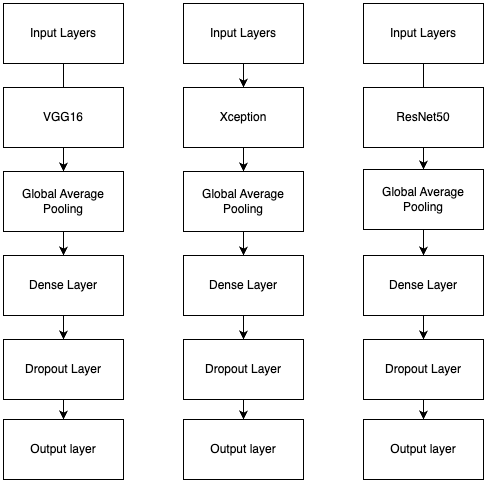
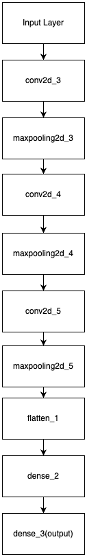
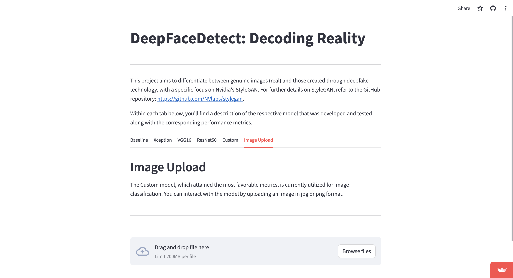

# DeepFaceDetect: Decoding Reality
This project endeavours to distinguish authentic images (real) from those generated using deepfake technology, utilizing convolutional neural networks (CNN) in deep learning.

## Project Approach

In this project, our strategy involves utilizing a diverse set of Convolutional Neural Network (CNN) models. The main goal is to develop a model proficient in discerning between genuine images (real) and those generated through deepfake technology, with a specific emphasis on Nvidia's StyleGAN (https://github.com/NVlabs/stylegan).

The dataset utilized in this project can be accessed here: https://www.kaggle.com/datasets/xhlulu/140k-real-and-fake-faces/data.

### Exploratory Data Analysis

- check for class imbalance
    - looked at each set of images for class imbalance, found that each set was labeled with binary classes(real, fake) at a 50/50 balance
- visually check images for anomalies, differences between the classes
    - visually checked a sample of real and fake images from each set of images(training, validation, testing)
    - there was nothing 
- check image sizes
    - checked the sizes of images within all the different sets of images
    - found that all the images were the same size
- check for rgb color
    - checked all images for rgb color
    - found that all images are rgb
- created color histograms for sample images
    - created color histograms for a sample of images
    - realized that I do not possess the knowledge to find anything of value from them
  
### Image Processing
- Utilize the ImageGenerator for image preprocessing.
- Scale image data between 0 and 1 to optimize for modeling.
- Apply the horizontal flip parameter for image augmentation to enhance the model's generalization capability.

### Model Creation

- Model Selection
    - As I have a novice level of knowledge in this topic I used https://www.mdpi.com/2076-3417/12/19/9820 as a starting point.
    - Used the following approach on the VGG16, Xception, and ResNet50 model architecture
        - Employed transfer learning by utilizing a pre-trained model.
        - Froze the layers to maintain the pre-trained weights and prevent unnecessary updates.
        - Established a learning rate of 0.001 for regularization purposes, controlling the step size during optimization.
        - Selected 100 epochs to ensure sufficient training time, considering the potential slower convergence associated with a low             learning rate.
        - Implemented early stopping, halting training if the loss did not decrease within 5 epochs, while preserving the best weights.
        - Structured the model architecture post pre-trained layers with:
        
            - Global Average Pooling layer to reduce dimensionality and capture important features effectively across the entire                   input
            - fully connected dense layer for further feature extraction and representation 
            - dropout layer to prevent overfitting by randomly dropping a fraction of input units during training
            - final fully connected dense layer for the ultimate output
            
            
            
    - Created a custom model with the following parameters:
        - Conv2D Layers:
            - conv2d_3: 32 filters with a kernel size of (3, 3), resulting in an output shape of (222, 222, 32).
            - conv2d_4: 64 filters with a kernel size of (3, 3), resulting in an output shape of (109, 109, 64).
            - conv2d_5: 128 filters with a kernel size of (3, 3), resulting in an output shape of (52, 52, 128).
            - These layers are used to extract features from the input image.

        - MaxPooling2D Layers:
            - max_pooling2d_3: Max pooling with a pool size of (2, 2), reducing the spatial dimensions by half (downsampling).
            - max_pooling2d_4: Max pooling with a pool size of (2, 2), again reducing spatial dimensions.
            - max_pooling2d_5: Max pooling with a pool size of (2, 2).
            - These layers perform max pooling to downsample and retain important features.

        - Flatten Layer:
            - flatten_1: Flattens the 3D output to a 1D array, preparing it for input into the fully connected layers.
            
        - Dense Layers:
            - dense_2: A fully connected dense layer with 128 neurons, performing further feature extraction.
            - dense_3: The final dense layer with a single neuron, producing the output for binary classification (1 for positive                     class, 0 for negative class).
            
            

### Model Deployment/App Creation
- Employed Streamlit for app creation and deployment, allowing users to view metrics for each model and interact with the custom model by uploading an image to receive a classification decision.
- The app is accessible at https://deepfacedetect.streamlit.app/.

## Results/Findings
- While all models exhibited decent metrics, an alternative approach in the custom model, involving max pooling over global pooling, omitting a dropout layer, and introducing an additional higher neuron dense layer, appeared to yield higher metrics. However, further testing is warranted for confirmation.

## Future Plans
- Exploring the integration of color histograms into the model training process is a goal.
- Further testing and parameter tuning for the custom model architecture.